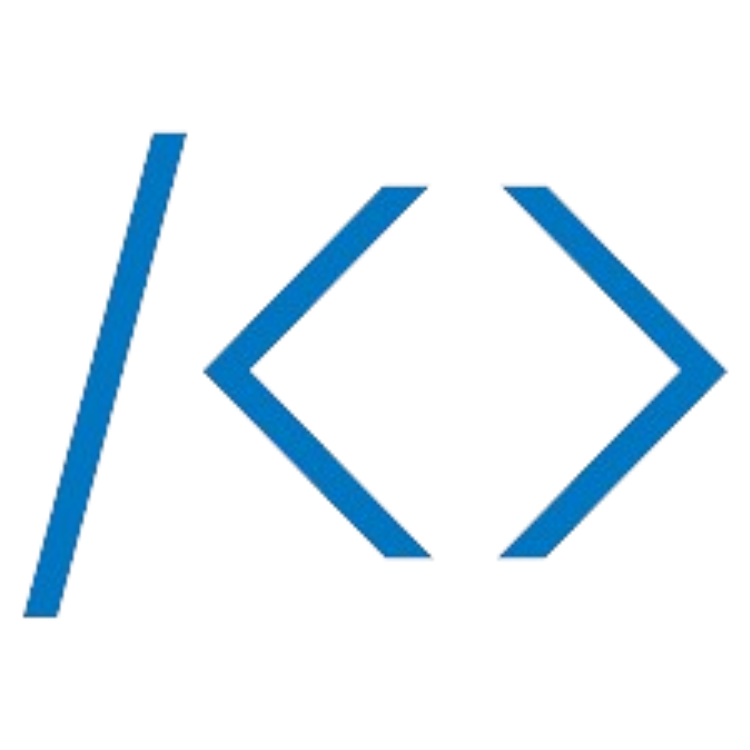

## 🌞 About Me

안녕하세요! (세울) 건 (아침 해) 욱, 아침 해 🌞를 세우는 함건욱입니다.

사랑하는 사람과 행복한 가정을 꾸리고 제가 좋아하는 일을 하며 살기 위해 노력하고 있습니다. 

 ISTP - 만능 재주꾼, 장인

  

  
  > 과묵하며 절제된 호기심으로 인생을 관찰하고, 상황을 파악하는 민감성과 도구를 다루는 뛰어난 능력이 있습니다. 말수가 적으며, 논리적이고 합리적입니다. 사실적 자료를 정리/조직하기를 좋아하고, 인과관계나 객관적 원리에 관심이 많습니다. 눈치가 빠릅니다. 조용히 자기 일만 하고 있는 것처럼 보이지만 사실 주변 상황 파악도 다 하고 있습니다.
  

 

축구와 컴퓨터 게임을 즐기며 냉면을 좋아하고 제 인생 영화는 어바웃 타임입니다. 

## ❤️ Final Vocabulury

목숨과도 바꿀 수 있는 저의 마지막 어휘는 **효율**입니다. 최소한의 노력으로 최대한의 성과를 얻기 위해 항상 생각하며 노력합니다. 어떠한 일을 진행할 때, 선택지를 나열하고 그 중 가장 최대의 효율을 낼 수 있는 선택지를 선택합니다.

## 🏃‍♂️ Activity
- 가천대학교 소프트웨어학과
- 가천대학교 X 카카오엔터프라이즈 SW 아카데미 2기
- 가천대 x Elastic Observability
- 정보처리기사

## 🌱 I’m Currently Learning  

  

     

    

   
   

   
   

  

   

##  GitHub

##  백준 티어

##  [프로그래머스 랭킹 뱃지](https://github.com/tomy8964/Programmers_Badge_Generator)
- 프로그래머스 랭킹 뱃지를 svg 형태로 제공하는 자바 프로젝트
- 백준 허브와 연동하여 프로그래머스에서 문제를 풀면 자동으로 프로그래머스 랭킹 뱃지를 생성 및 업데이트합니다.
- 깃허브 프로필에 뱃지를 등록할 수 있습니다.

##  [개발 블로그](https://velog.io/@tomy8964)    
- 기간 : 2023.11.21 ~ (진행 중)
- 게시글 수 : 298 ~ (진행 중)
  

## 👻 [이력서](https://tomy8964.notion.site/89b411103c1345e1b907951a5f41aad7)

## 📫 How to reach me: [tomy8964@naver.com](mailto:tomy8964@naver.com)

<!--
**tomy8964/tomy8964** is a ✨ _special_ ✨ repository because its `README.md` (this file) appears on your GitHub profile.

Here are some ideas to get you started:

- 🔭 I’m currently working on ...
- 🌱 I’m currently learning ...
- 👯 I’m looking to collaborate on ...
- 🤔 I’m looking for help with ...
- 💬 Ask me about ...
- 📫 How to reach me: ...
- 😄 Pronouns: ...
- ⚡ Fun fact: ...
-->