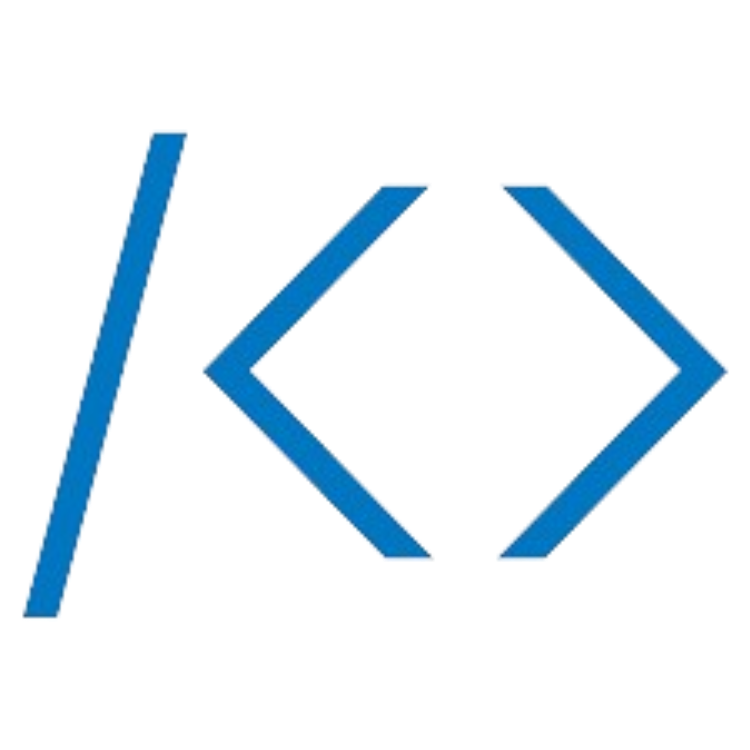

## 🌞 About Me

안녕하세요! (세울) 건 (아침 해) 욱, 아침 해 🌞를 세우는 함건욱입니다.

사랑하는 사람과 행복한 가정을 꾸리고 제가 좋아하는 일을 하며 살기 위해 노력하고 있습니다. 

 ISTP - 만능 재주꾼, 장인

  

  
  > 과묵하며 절제된 호기심으로 인생을 관찰하고, 상황을 파악하는 민감성과 도구를 다루는 뛰어난 능력이 있습니다. 말수가 적으며, 논리적이고 합리적입니다. 사실적 자료를 정리/조직하기를 좋아하고, 인과관계나 객관적 원리에 관심이 많습니다. 눈치가 빠릅니다. 조용히 자기 일만 하고 있는 것처럼 보이지만 사실 주변 상황 파악도 다 하고 있습니다.
  

 

축구와 컴퓨터 게임을 즐기며 냉면을 좋아하고 제 인생 영화는 어바웃 타임입니다. 

---

## ❤️ Final Vocabulary

**효율**입니다. 

최소한의 노력으로 최대한의 성과를 얻기 위해 항상 생각하며 노력합니다. 어떠한 일을 진행할 때, 선택지를 나열하고 그 중 가장 최대의 효율을 낼 수 있는 선택지를 선택합니다.

---

## 👻 이력서

[블로그](https://velog.io/@tomy8964/series) | [GitHub](https://github.com/tomy8964) | [포트폴리오](https://tomy8964.notion.site/portfolio) | 정보처리기사 취득 | 리눅스마스터 2급 | [가천대학교 소프트웨어학과](https://sw.gachon.ac.kr/cms/) 졸업 | 3.84/4.5 | 3.9/4.5

Java, Spring Boot, JPA | MySQL, Redis | Jenkins, ArgoCD | Docker, k8s, Prometheus, ELK |  AWS

---

### 👔 경력

**안랩** (연구인프라팀 | DevOps | 2026.02 ~)

**신한투자증권 인턴** (ICT기획운영부 | 2025.04 ~ 05)

- NHN Cloud 환경에서 Kubernetes 기반 MSA 아키텍처 구축, 고가용성 구조 설계 및 구현
- Helm + ArgoCD 기반 GitOps 파이프라인 구축으로 배포 신뢰성 및 재현성 확보
- 멀티 Kubernetes 클러스터 운영 + Prometheus, Grafana 멀티 클러스터 모니터링 구축

---

### 🚀 프로젝트

[**AWS MSA 기반 실시간 해외 공시 기반 트레이딩 시스템**](https://github.com/Pda-Final-Project) (2025.02 ~ 03 | 최우수상 수상)

- 공시 번역 파이프라인 최적화 (처리 속도 90% 단축, 10분 → 1분)
- 예산 제약으로 직접 k8s 클러스터, MySQL InnoDB Cluster, Redis Cluster 구축
- 초당 수백 건의 체결 데이터 Redis Pub/Sub + SSE로 안정적 처리
- ALB 전환으로 AWS API Gateway 504 오류 해소, 장기 연결 지원
- Jenkins·GitHub·Docker·ArgoCD 기반 무중단 배포 파이프라인 구축
- Prometheus·Grafana 모니터링 구축 및 알림 설정

[**GCP MSA 기반 설문 관리•분석 시스템**](https://github.com/tomy8964/Swave_Survey_Update) (2023.10 ~ 2024.04)

- 핵심 병목 제거로 TPS 60.4 → 848.1 (14배) 향상
- Redis 분산락을 AOP로 적용하여 동시 응답 제어 및 로직 분리
- JWT 인증을 Spring Filter 레벨로 처리해 인증 구조 단순화
- 테스트 커버리지 100% (147건) 달성, 안정성 검증 자동화
- Terraform 기반 GKE IaC 전환, 기존 인프라 코드 관리 체계화
- Prometheus·Grafana·EFK 통합 모니터링 구축, 지표 기반 성능 분석 및 경보 설정

[**쿠버네티스 기반 관리형 Redis 서비스 개발**](https://github.com/tomy8964/Redis-Operator) (2025.08)
- [쿠버네티스 Operator로 구현하는 나만의 관리형 Redis 서비스 개발기](https://velog.io/@tomy8964/%EC%BF%A0%EB%B2%84%EB%84%A4%ED%8B%B0%EC%8A%A4-%EA%B8%B0%EB%B0%98-%EA%B4%80%EB%A6%AC%ED%98%95-Redis-%EC%84%9C%EB%B9%84%EC%8A%A4-%EA%B0%9C%EB%B0%9C)

**쿠버네티스 Deployment 실시간 모니터링 시스템 개발** (2025.01)
- [쿠버네티스 Deployment 실시간 모니터링 시스템에서 부딪힌 문제와 해결 과정](https://velog.io/@tomy8964/%EC%BF%A0%EB%B2%84%EB%84%A4%ED%8B%B0%EC%8A%A4-Deployment-%EC%8B%A4%EC%8B%9C%EA%B0%84-%EB%AA%A8%EB%8B%88%ED%84%B0%EB%A7%81-%EC%8B%9C%EC%8A%A4%ED%85%9C%EC%97%90%EC%84%9C-%EB%B6%80%EB%94%AA%ED%9E%8C-%EB%AC%B8%EC%A0%9C%EC%99%80-%ED%95%B4%EA%B2%B0-%EA%B3%BC%EC%A0%95)

---

### 🛩️ 오픈소스

*   **Spring Cloud Config | AWS S3 `searchPaths` 와일드카드 지원 (신규 기능 구현)**
    *   **Links:** [Issue #2812](https://github.com/spring-cloud/spring-cloud-config/issues/2812) ｜ [PR #2958](https://github.com/spring-cloud/spring-cloud-config/pull/2958)
    *   **Details:** S3 백엔드에 Git 방식과 동일한 `searchPaths` 및 와일드카드(`*`, 플레이스홀더) 지원 기능을 신규 추가했습니다. 이를 통해 사용자가 기존 파일명이나 폴더 구조를 변경할 필요 없이, 기존 Git 기반 설정을 S3로 매끄럽게 마이그레이션할 수 있도록 환경을 개선했습니다.

*   **kubernetes-mixin | `KubePodNotReady` 알림 규칙 개선 및 오탐 방지**
    *   **Links:** [Issue #2637](https://github.com/prometheus-operator/kube-prometheus/issues/2637) ｜ [PR #1239](https://github.com/kubernetes-monitoring/kubernetes-mixin/pull/1239) ｜ [HOTFIX PR #1243](https://github.com/kubernetes-monitoring/kubernetes-mixin/pull/1243)
    *   **Details:** `KubePodNotReady` 알림이 Readiness Probe 실패로 인해 실질적인 서비스가 불가능한 Pod를 감지하지 못하는 문제를 해결하기 위해 메트릭 조건을 보강했습니다. 또한, 배포 후 발견된 정상 Pod에 대한 오탐(False Positive) 이슈를 핫픽스로 신속하게 수정하여 모니터링 알림의 신뢰도를 높였습니다.

*   **Backstage | 신규 프론트엔드 시스템 컴포넌트 Export 구조 개선**
    *   **Links:** [Issue #34456](https://github.com/backstage/backstage/issues/34456) ｜ [PR #34475](https://github.com/backstage/backstage/pull/34475)
    *   **Details:** 신규 프론트엔드 시스템(Alpha) 환경에서 `ApiExplorerPage`가 레거시 UI를 내보내어 커스터마이징을 방해하던 문제를 해결했습니다. 올바른 컴포넌트가 Export 되도록 구조를 수정하여, 사용자가 최신 헤더 디자인으로 페이지를 자유롭게 커스텀할 수 있도록 개선했습니다.

---

### 🚴‍♂️ 대외활동

- [**신한투자증권 프로 디지털 아카데미 5기**](https://sesac.seoul.kr/course/active/detail.do?courseActiveSeq=1580&srchCategoryTypeCd=&courseMasterSeq=327&currentMenuId=900002001&utm_source=boottent&utm_medium=referral) (2024.09 ~ 2025.03 | 중간·최종 최우수상, 우수 수료자)
- [**가천대학교 x 카카오엔터프라이즈 SW 아카데미 2기**](https://www.gachon.ac.kr/kor/1148/subview.do?enc=Zm5jdDF8QEB8JTJGYmJzJTJGa29yJTJGNDgwJTJGODIyOTQlMkZhcnRjbFZpZXcuZG8lM0Y%3D) (2023.03 ~ 08)
- [**가천대 x Elastic Observability 해커톤**](https://www.gachon.ac.kr/pr/1443/subview.do?enc=Zm5jdDF8QEB8JTJGYmJzJTJGcHIlMkY0NjQlMkY4OTU5MSUyRmFydGNsVmlldy5kbyUzRg%3D%3D)
- [**GitHub Programmers 랭킹 뱃지 자동 생성 오픈소스 운영**](https://github.com/tomy8964/Programmers_Badge_Generator)
- [**가오리의 개발 블로그**](https://velog.io/@tomy8964/series) (인프런 김영한의 실전 자바 & Spring & SpringBoot + JPA 총 13개의 과정 수료)

---

## 🌱 I’m Currently Learning  

  

     
     
      
      

   
   

   
   

   
   

  

   
  

##  GitHub

##  백준 티어

##  [프로그래머스 랭킹 뱃지](https://github.com/tomy8964/Programmers_Badge_Generator)

## 📫 How to reach me: [tomy8964@naver.com](mailto:tomy8964@naver.com)

<!--
**tomy8964/tomy8964** is a ✨ _special_ ✨ repository because its `README.md` (this file) appears on your GitHub profile.

Here are some ideas to get you started:

- 🔭 I’m currently working on ...
- 🌱 I’m currently learning ...
- 👯 I’m looking to collaborate on ...
- 🤔 I’m looking for help with ...
- 💬 Ask me about ...
- 📫 How to reach me: ...
- 😄 Pronouns: ...
- ⚡ Fun fact: ...
-->
